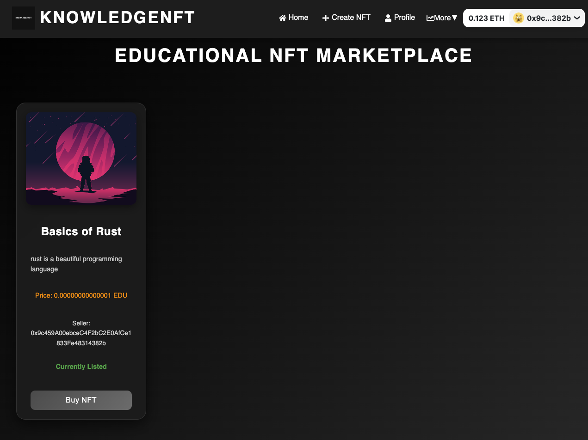

# KnowledgeNFT Protocol

## Project Overview

**KnowledgeNFT** is a decentralized marketplace built on Ethereum Sepolia, designed to tokenize and trade educational resources as NFTs. This platform enables creators to mint educational materials such as courses, eBooks, and tutorials as NFTs. Buyers and sellers can interact seamlessly in a secure marketplace, benefiting from detailed analytics, insights, and profile management features.

### Key Features
- **NFT-based Education Resources**: Each educational resource is minted as a unique NFT, ensuring proof of ownership and traceability.
- **Comprehensive Analytics**: Advanced analytics pages provide valuable insights into the performance and trends of educational content.
  - **Wallet Profiling**: Monitor wallet activity, transaction history, and portfolio performance of users on the platform.
  - **Marketing Insights**: Track the performance of various marketing campaigns and their impact on resource sales.
  - **Collection Analytics**: View detailed metrics on the most popular courses, sales volumes, and trending educational content.
- **Marketplace Transactions**: Buy, sell, and resell educational NFTs with secure, transparent blockchain transactions.

## Problem Statement

Current educational platforms lack a decentralized system for trading knowledge-based resources. KnowledgeNFT solves this by leveraging blockchain technology to ensure ownership, authenticity, and seamless transactions for educational resources. Additionally, it offers detailed analytical insights for users and creators to maximize their impact and performance.

## Pages Overview

### **walletProfiling.jsx**
This page provides a comprehensive view of the user's wallet activity. By profiling each user’s interaction with the marketplace, it displays:
- **Transaction History**: A detailed list of the user's transactions, including purchase and sale of educational resources.
- **NFT Portfolio**: A display of all the NFTs owned by the user, including educational courses, eBooks, and tutorials.
- **Wallet Balance**: Real-time ETH balance of the user's wallet.
- **Activity Breakdown**: Visual representation of purchases, sales, and other interactions in the marketplace over time.

### **MarketingInsights.jsx**
This page focuses on the marketing performance of educational resources. It helps creators and marketers track the effectiveness of their campaigns:
- **Sales Trends**: Visual charts showing the number of sales and revenue over specific periods.
- **Traffic Analysis**: Insights into the number of visitors, unique users, and how marketing efforts have affected the resource views and interactions.
- **Conversion Metrics**: Analyze the conversion rates of various marketing campaigns, including discounts, promotions, or influencer partnerships.
- **Top-Performing Resources**: View the most popular educational courses based on sales, views, and user interactions.

### **collectionAnalytics.jsx**
This page provides detailed metrics on the marketplace’s most popular collections:
- **Top-Selling Resources**: A leaderboard showcasing the top-selling educational resources on the platform.
- **Sales Volume**: Breakdown of sales volume across various resource categories.
- **Trending Courses**: Insights into the educational resources that are gaining popularity, based on recent sales data.
- **Resource Categories**: Analytics for each type of resource (e.g., eBooks, courses, tutorials), allowing users to explore trends in specific niches.

## Getting Started

### Prerequisites
- Basic understanding of Ethereum blockchain and smart contract deployment.
- A wallet such as MetaMask.
- Solidity 0.8.0 or higher.
- React.js for front-end integration.
- Web3.js for Ethereum interaction.

### Installation
1. Clone the repository to your local machine.
2. Install dependencies: npm install
3. Compile and deploy the smart contract using Remix IDE or another Ethereum development environment.
4. Set up your wallet and connect it to the Ethereum Sepolia network or other supported networks.
5. For the front-end, navigate to the `client` directory: cd client npm install npm start

### Deployment
Deploy the **KnowledgeNFT** smart contract on Ethereum Sepolia or mainnet. Adjust the listing prices, resource metadata, and marketplace configurations accordingly.

## Interacting with the Contract

### Educator Actions
- **Create Course**: Mint a new educational resource as an NFT, providing details such as course name, description, URI (content link), and price.
- **List/Resell Course**: List an educational resource for sale, or resell previously purchased content.
- **Update Course Details**: Update the price, description, or metadata of an existing NFT.

### Learner Actions
- **Buy Course**: Purchase an educational resource from the marketplace by paying the listed price.
- **View Courses**: Browse and filter through available educational resources.
- **Wallet Profiling**: View transaction history and portfolio performance via **walletProfiling.jsx**.
- **Marketing Insights**: View the impact of specific campaigns through **MarketingInsights.jsx**.

### Owner/Admin Actions
- **Withdraw Funds**: Withdraw the contract's accumulated funds.
- **Update Listing Fees**: Modify the listing price for educational resources.

## Contract Functions

### Educator Functions
- `createCourse(string memory courseName, string memory courseURI, uint256 price, string memory courseDescription)`: Mint a new course NFT and list it.
- `updateListPrice(uint256 _listPrice)`: Set the listing price for educational resources.
- `getLatestListedCourse()`: Retrieve the details of the most recently listed course.

### Learner Functions
- `executeSale(uint256 courseId)`: Purchase an educational resource by submitting the asking price.
- `resellCourse(uint256 courseId, uint256 price)`: Resell a previously purchased course NFT.
- `getAllCourses()`: Retrieve a list of all listed courses.

### Admin Functions
- `withdraw()`: Withdraw accumulated fees and funds.
- `updateListPrice(uint256 _listPrice)`: Update the listing price.

## Future Development
- **Advanced Analytics**: Provide more granular analytics, including demographic data for resource buyers.
- **AI-Powered Insights**: Implement machine learning models to provide personalized marketing suggestions for educators based on historical data.
- **Cross-Chain Support**: Extend the platform to support multiple blockchains, making it more accessible to users on different networks.

## Contributing

Contributions are welcome! If you'd like to contribute to this project, please fork the repository, make your changes, and submit a pull request.

## License

This project is licensed under the MIT License. See the LICENSE file for details.

## Support

For any inquiries or support, please open an issue in the GitHub repository or contact us via email.

## Links
- GitHub Repository: [https://github.com/yourusername/KnowledgeNFT]()
- Project Demo: [Watch here](#)
- Project Website: [https://knowledge-nft.com](https://knowledge-nft-chi.vercel.app/)

